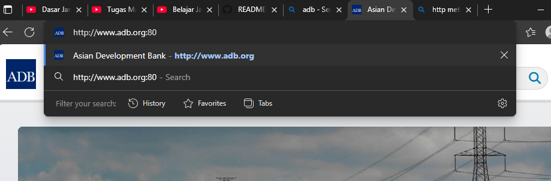
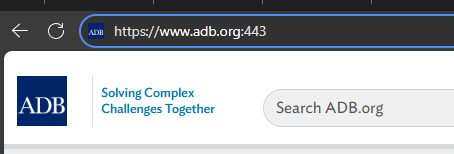
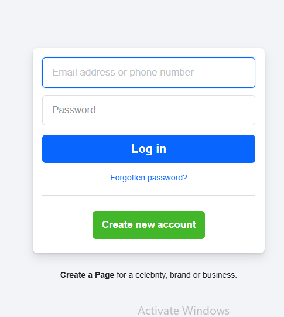

# Protokol

## HTTP

Contoh protokol http
dia melayani di port 80, apabila akses browser:

Protokol https melayani di port 443

Semua browser itu methode GET ketika membuka pertama kali

Ketika mengirim data menggunakan HTTP Post

sama halnya dengan PUT, PATCH, Delete itu biasanya menggunakan form.

Bedanya :
1. PUT : Update data keseluruhan
2. PATCH : Update data sebagian
3. DELETE : Menghapus satu data/keseluruhan

